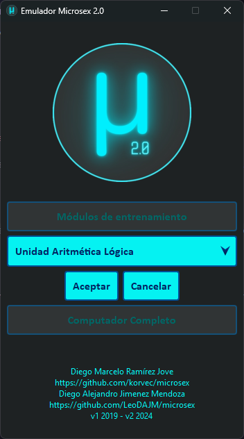
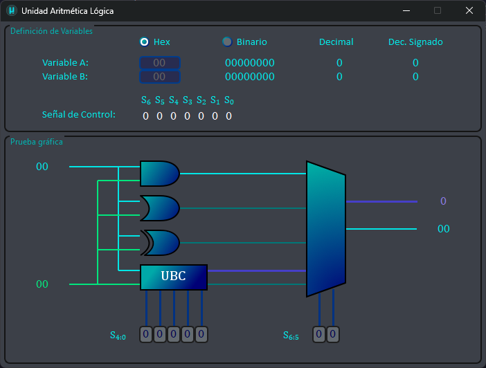

# Descripción Unidad Aritmética Lógica

## Selección de Módulo.

Al abrir el proyecto, se muestra la pantalla inicial que nos permite elegir el múdlo a ejecutar, en este caso, se debe elegir el módulo `Unidad Aritmética Lógica`:

Y darle click en `Aceptar` para iniciar el módulo.

