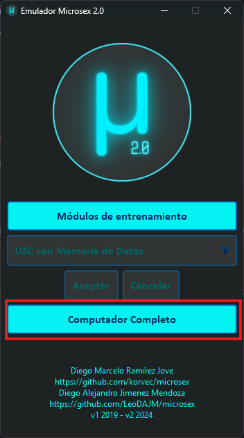
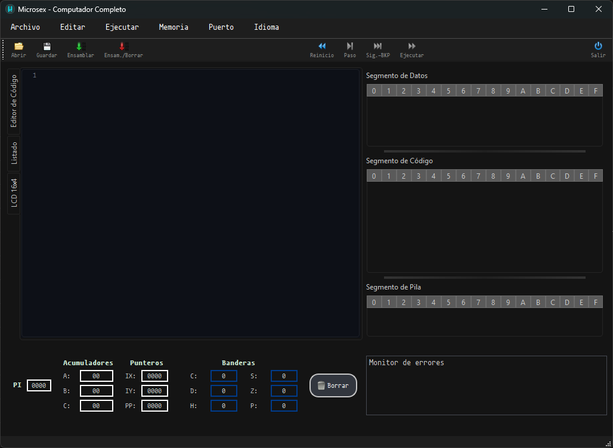

# Descripción Modulo Computador Completo

Es una plataforma de desarrollo diseñada para facilitar la programación en **Microsex**, un lenguaje ensamblador propio basado en una Unidad Secuencial de Cálculo Extendido (USCE). Este entorno ofrece herramientas avanzadas para la escritura, depuración y simulación de código ensamblador, optimizando tanto la gestión de la memoria como la interacción con los segmentos de Pila, Datos y Código.

## Selección de Módulo.

Al abrir el proyecto, se muestra la pantalla inicial que nos permite elegir el múdlo a ejecutar, en este caso, se debe hacer click en el botón `Computador Completo`:

Y se inicia el módulo.

