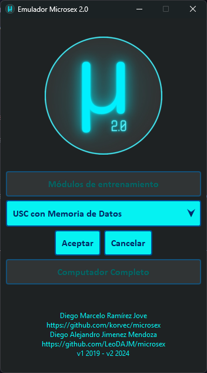
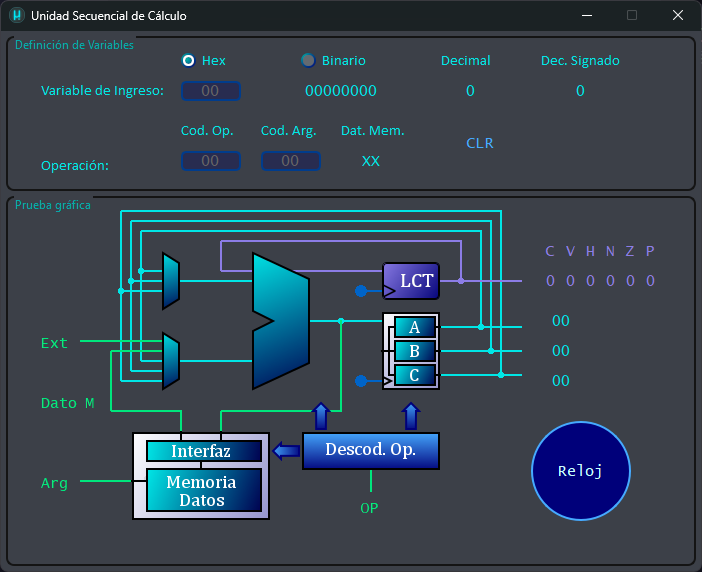

# Descripción Unidad Básica de Cálculo Expandido

## Selección de Módulo.

Al abrir el proyecto, se muestra la pantalla inicial que nos permite elegir el múdlo a ejecutar, en este caso, se debe elegir el módulo `USC con Memoria de Datos`:

Y darle click en `Aceptar` para iniciar el módulo.

